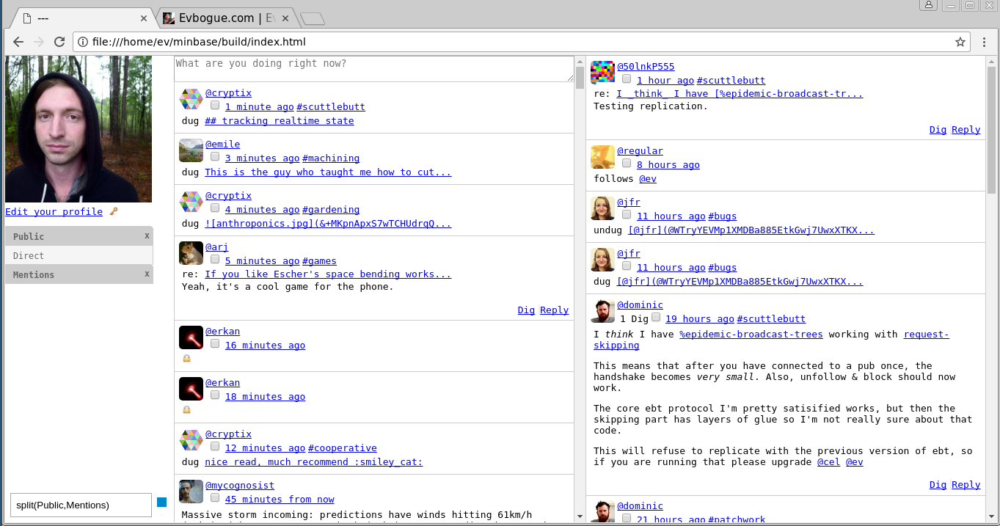

# Minbase

Minbase is an unopinionated minimal base on which to build opinionated [Secure Scuttlebutt](http://scuttlebot.io) clients. 

Scuttlebot is [An off-grid social network](https://staltz.com/an-off-grid-social-network.html). 

Minbase is maintained by [Everett Bogue](http://evbogue.com/) - [@ev](http://evbogue.com:8807/@8Qee0I/DwI5DHSCi3p5fsl6FyLGArrnDz3ox9qZr5Qc=.ed25519) on ssb. 

### Origins

Minbase is a fork of [Patchbay@6.1.3](https://github.com/ssbc/patchbay/commit/e3a918ef0b3864578f624ca14e12fe1cf0079b3a), which was originally written by Dominic Tarr. In the beginning I wanted to find out just how minimal Patchbay could be, with the idea that 'minbay' would get merged into Master as a depject configuration, however that never happened so now it's a fork as Patchbay@7 and Minbase are now barely resemble each other. Minbase shares a lot of the original Patchbay@6 code, with minimal modifications. 

## Minbase clients

+ [Minbay](http://gitmx.com/%25UTn%2FAoIVVF%2F4yKI7PKIWrHeWb1q7sTMCWVyYY1XTiCk%3D.sha256)
+ [Micropub](http://gitmx.com/%25LwAM2X9dd%2Fy%2FilB%2FYQ93X3zu8Ket1BDEqmZf0EaVrv0%3D.sha256)

## Installation

With [git-ssb](http://gitmx.com/%25n92DiQh7ietE%2BR%2BX%2FI403LQoyf2DtR3WQfCkDKlheQU%3D.sha256)
```
git clone ssb://%+tyUthD1L689osLUj8LNLV4smRKpO7Wu07DB+LMd7TQ=.sha256 minbase 
```

With [Github](http://github.com/evbogue/minbase)

```
git clone git@github.com:evbogue/minbase.git
```

Next use npm or yarn to install dependencies, build the client, and start minbase.

``` 
cd minbase
npm install
npm run build
npm start
```

Minbase will start a local sbot instance using `ssb-party`. 

You'll see a lite client invite on your command line. Click the lite client invite and accept to generate a new identity and load the websocket server into your browser. If you want to import your ssb identity, load your public/private key from `.ssb/secret` into the 'Your Key' tab in minbase.

Minbase also works with Electron. `sudo npm install -g electro` and run minbase using electron `electro index` -- this won't start the scuttlebot server, so do that in another window.

## License

MIT
